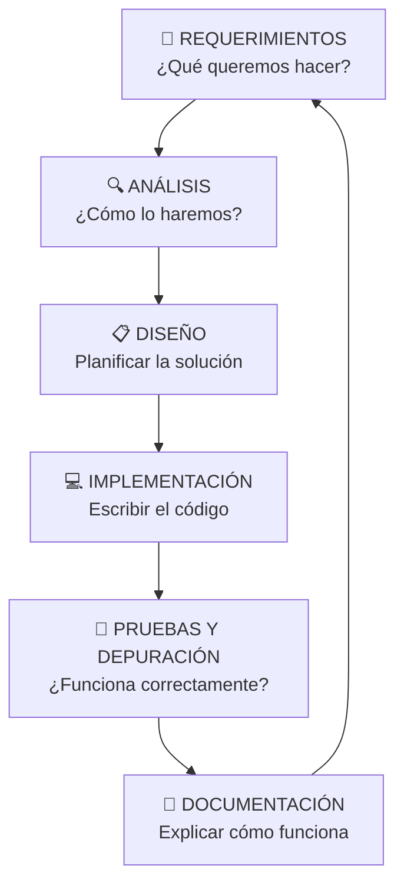

# Capítulo 1: ¿Qué es Programar? De la Idea al Código

### 1.1. El Arte y la Ciencia de Resolver Problemas

Bienvenido al fascinante mundo de la programación. Lejos de ser una simple tarea técnica, programar es una disciplina dual que fusiona la creatividad del arte con el rigor de la ciencia. Es el proceso de transformar una idea abstracta en una solución concreta y ejecutable por una máquina. En este primer capítulo, sentaremos las bases conceptuales para que comprendas no solo qué es un programa, sino todo el viaje que recorre una idea hasta convertirse en software funcional, un viaje que te enseñará a pensar de una forma nueva, estructurada y poderosa.

Como expresó magistralmente **Bjarne Stroustrup**, creador del lenguaje C++:

_<mark style="background-color:green;">"</mark><mark style="background-color:green;">**La programación es el arte de expresar soluciones a problemas de manera que un ordenador sea capaz de ejecutar esas soluciones. Gran parte del esfuerzo en la programación se consume precisamente buscando y refinando las posibles soluciones. A menudo, un problema solo se entiende completamente a través del proceso de programar una solución**</mark><mark style="background-color:green;">"</mark>_ <mark style="background-color:green;"></mark><mark style="background-color:green;">.</mark>

Esta cita encierra una verdad profunda: el acto de programar no es meramente "escribir código". Es un ejercicio de entendimiento. Al intentar traducir una solución a un lenguaje formal y sin ambigüedades, nos vemos obligados a confrontar cada detalle, cada caso límite y cada posible error de nuestra lógica. Es en este proceso de formalización donde nuestra comprensión del problema se pule y perfecciona. Programar, por tanto, es una herramienta para pensar con claridad.

Esta dualidad entre la libertad creativa y la necesidad de precisión es lo que hace de la programación una disciplina única.

| Dimensión Artística                                                                                                                                                                                | Dimensión Científica                                                                                                                                                                  |
| -------------------------------------------------------------------------------------------------------------------------------------------------------------------------------------------------- | ------------------------------------------------------------------------------------------------------------------------------------------------------------------------------------- |
| **Creatividad**: Ante un mismo problema, existen innumerables caminos para llegar a una solución. La elección de uno u otro depende de la visión y la inventiva del programador.                   | **Rigor Lógico**: Cada instrucción debe ser precisa, inequívoca y basarse en principios lógicos sólidos. El ordenador no interpreta intenciones, solo ejecuta órdenes exactas.        |
| **Estilo Personal**: La forma en que se estructura el código, se nombran las variables o se comentan las secciones complejas, constituye una "firma" que refleja la filosofía de quien lo escribe. | **Metodología**: El desarrollo de software sigue procesos estructurados y sistemáticos para garantizar la calidad, la repetibilidad y el éxito del proyecto.                          |
| **Elegancia**: Un código "elegante" es aquel que resuelve un problema complejo de forma simple, clara y eficiente. Es una belleza funcional que trasciende la mera corrección.                     | **Verificación Empírica**: Una solución no es válida hasta que se demuestra que funciona a través de pruebas rigurosas. La experimentación y la validación son pilares fundamentales. |
| **Proceso Iterativo**: Como el escultor que va refinando su obra, el programador mejora constantemente sus soluciones, optimizando, simplificando y perfeccionando el código.                      | **Optimización Basada en Métricas**: Una solución no solo debe ser funcional, sino que debe ser òptima, resultando vital la mejora de rendimiento mediante la medición objetiva.      |

Para navegar esta dualidad con éxito, necesitamos una hoja de ruta, una receta que describa nuestra solución de forma clara antes de escribir una sola línea de código. Esa receta es el **algoritmo**.

### 1.2. El Algoritmo: La Receta del Éxito

Un **algoritmo** es el pilar fundamental de cualquier programa. Es una **secuencia de pasos finitos, ordenados y no ambiguos, diseñados para resolver un problema específico**. Piénsalo como una receta de cocina: te indica los ingredientes (_**datos de entrada**_), una serie de pasos precisos a seguir (_**proceso**_) y el plato final que obtendrás (_**resultado**_). Si la receta es ambigua ("añade un poco de sal"), el resultado será inconsistente. Si los pasos están desordenados, el plato será un desastre.

Otra analogía útil son las indicaciones de un GPS. Para llevarte de un punto A a un punto B, el GPS calcula una secuencia de giros y movimientos específicos: "Avanza 500 metros", "Gira a la derecha en la Calle Mayor", "Continúa 1 kilómetro". Esta secuencia es el algoritmo. El GPS, al ejecutarla, materializa la solución.

Para que una secuencia de pasos sea considerada un algoritmo válido, debe cumplir tres características esenciales:

<mark style="background-color:$primary;">🎯</mark> <mark style="background-color:$primary;"></mark><mark style="background-color:$primary;">**Precisión**</mark><mark style="background-color:$primary;">:</mark> Cada paso debe estar definido de forma clara y sin ambigüedad. No hay lugar para la interpretación.

* ❌No es preciso: "Calienta el horno a una temperatura alta".
* ✅Es preciso: "Precalienta el horno a 200°C durante 15 minutos".

<mark style="background-color:$primary;">🔄</mark> <mark style="background-color:$primary;"></mark><mark style="background-color:$primary;">**Determinismo**</mark><mark style="background-color:$primary;">:</mark> Si sigues el algoritmo varias veces con los mismos datos de entrada, siempre debes obtener el mismo resultado.

* ❌No es determinista: "Saluda al usuario con un 'Buenos días', 'Buenas tardes' o 'Buenas noches' dependiendo de la hora actual del sistema". (El resultado varía según cuándo se ejecute).
* ✅Esdeterminista: "Dado un número X, calcula la expresión `y = 2x + 1`". (Para X=5, el resultado siempre será 11).

<mark style="background-color:$primary;">⏹️</mark> <mark style="background-color:$primary;"></mark><mark style="background-color:$primary;">**Finitud**</mark><mark style="background-color:$primary;">:</mark> El algoritmo debe terminar después de un número finito de pasos. Nunca puede quedarse en un bucle infinito.

* ❌No es finito: "Continúa lanzando un dado hasta que salga un 6". (Teóricamente, podría no terminar nunca).
* ✅Es finito: "Lanza un dado 100 veces y cuenta cuántas veces ha salido el 6".

<mark style="background-color:yellow;">💡</mark> <mark style="background-color:yellow;"></mark><mark style="background-color:yellow;">**Buenas Prácticas:**</mark> <mark style="background-color:yellow;"></mark><mark style="background-color:yellow;">Piensa antes de picar código</mark>

Muchos programadores novatos sienten la tentación de empezar a escribir código inmediatamente. Sin embargo, **invertir tiempo en diseñar un buen algoritmo** primero es una de las prácticas más rentables que existen:

* **Clarifica el Problema**: Te obliga a entender a fondo qué debes resolver antes de cómo resolverlo.
* **Reduce Errores**: Es mucho más fácil y rápido detectar un fallo lógico en un diagrama o pseudocódigo que en cientos de líneas de código.
* **Optimiza la Solución**: Permite comparar diferentes enfoques y elegir el más eficiente sobre el papel.
* **Ahorra Tiempo a Largo Plazo**: El tiempo "perdido" diseñando se recupera con creces al evitar horas de depuración y reescritura de código.

Una vez que tenemos nuestro algoritmo, nuestra "receta", el siguiente paso es traducirlo a un idioma que la máquina pueda entender y ejecutar.

### 1.3. El Programa: La Materialización del Algoritmo

Un programa es la implementación concreta de un algoritmo utilizando la sintaxis y las reglas de un lenguaje de programación específico (como Python, Java o C++). Es la materialización de la lógica que hemos diseñado, lista para ser ejecutada por un ordenador.

La siguiente tabla resume las diferencias clave:

| Aspecto          | Algoritmo                        | Programa                       |
| ---------------- | -------------------------------- | ------------------------------ |
| **Lenguaje**     | Natural (español, diagramas)     | Formal (Python, Java, C++)     |
| **Audiencia**    | Seres humanos                    | Ordenadores                    |
| **Precisión**    | Puede tener ambigüedades menores | Debe ser absolutamente preciso |
| **Ejecución**    | Requiere interpretación humana   | Ejecutable por máquina         |
| **Flexibilidad** | Alta, permite adaptaciones       | Rígida, sigue reglas estrictas |

La creación de un programa no es un acto aislado, sino que forma parte de un proceso estructurado conocido como el Ciclo de Desarrollo de Software. Aunque existen muchas metodologías, las fases fundamentales son:

1. **Requerimientos**: Entender qué problema debe resolver el software.
2. **Análisis**: Estudiar la viabilidad y modelar cómo funcionará el sistema.
3. **Diseño**: Crear la arquitectura, las interfaces y, crucialmente, los algoritmos.
4. **Implementación**: Escribir el código (crear el programa).
5. **Pruebas**: Verificar que el programa funciona correctamente y cumple los requerimientos.
6. **Documentación**: Preparar manuales para usuarios y desarrolladores.

Es importante destacar que este ciclo no es estrictamente lineal. A menudo es un proceso iterativo, donde se vuelve a fases anteriores para refinar ideas, corregir errores o añadir nuevas funcionalidades.

***

### Resumen del Capítulo

En este capítulo, hemos establecido que la programación es una disciplina que combina la creatividad artística con el rigor científico. El pilar de cualquier solución de software es el algoritmo, una receta precisa, determinista y finita que define la lógica. El programa es la traducción de ese algoritmo a un lenguaje de programación, un proceso que se enmarca dentro del Ciclo de Desarrollo de Software.

#### **💡 Conceptos Clave**:

* **Programación (Arte y Ciencia)**: Disciplina dual que requiere creatividad y lógica.
* **Algoritmo**: Secuencia de pasos para resolver un problema. Debe ser Preciso, Determinista y Finito.
* **Programa**: Implementación de un algoritmo en un lenguaje de programación.
* **Ciclo de Desarrollo de Software**: Fases estructuradas para crear software (Requerimientos, Análisis, Diseño, Implementación, Pruebas, Documentación).

#### **🤔 Preguntas de Reflexión**:

1. ¿Qué ventajas crees que tiene considerar la programación como un arte además de como una ciencia?
2. ¿Qué consecuencias prácticas puede tener saltarse la fase de diseño del algoritmo y empezar a codificar directamente?
3. Piensa en una tarea cotidiana que realices (como prepararte el desayuno) y trata de describirla como un algoritmo, asegurándote de que cumple las tres características esenciales.

***
